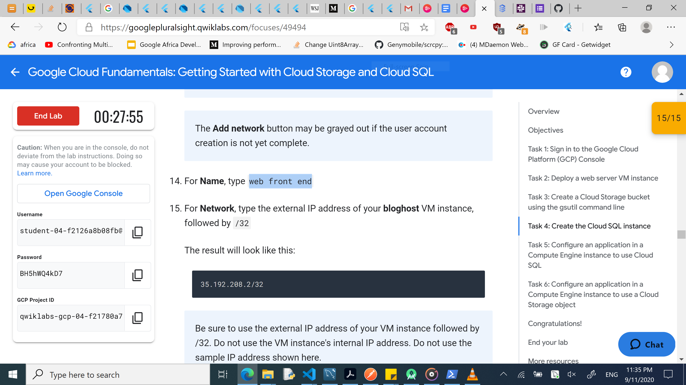

<!-- Change title below -->

# gads-2020-project-submission-template

## QwikLabs Completed

<details>
  <!-- The complete lab title goes here 👇🏾-->
  <summary>Lab 1: 
Google Cloud Fundamentals: Getting Started with Compute Engine
</summary>
  <!-- Provide path to the screenshot here. Example 👇🏾-->
  
</details>

## Translation code

```
After opening the cloud shell. I used the following command to set configure my project as the default one :
>>gcloud config set project qwiklabs-gcp-02-d3bb637b8d64 (qwiklabs-gcp-02-d3bb637b8d64 was my project Id).

To list the zones available for my project i used the following command:
>>gcloud compute zones list | grep us-central1

After seeing the available regions under the us-central region by the previous command, used the following command to set the us-central1-b as the default zone

>> gcloud config set compute/zone us-central1-b

To create a VM instance called my-vm-2 in that zone, I executed this command:
>>gcloud compute instances create "my-vm-2" \
--machine-type "n1-standard-1" \
--image-project "debian-cloud" \
--image "debian-9-stretch-v20190213" \
--subnet "default"
```

<details>
  <!-- The complete lab title goes here 👇🏾-->
  <summary>Lab 2: GCP Fundamentals: Getting Started with Cloud Storage and Cloud SQL</summary>
  <!-- Provide path to the screenshot here. Example 👇🏾-->
  
</details>

## Translation code

```
Your translations code can rest here
```
