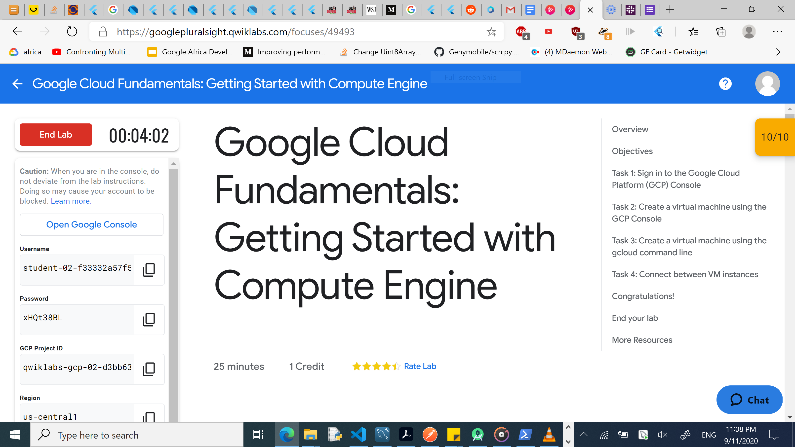

<!-- Change title below -->

# gads-2020-project-submission-template

## QwikLabs Completed

<details>
  <!-- The complete lab title goes here 👇🏾-->
  <summary>Lab 1: 
Google Cloud Fundamentals: Getting Started with Compute Engine
</summary>
  <!-- Provide path to the screenshot here. Example 👇🏾-->
  
</details>

## Translation code

```
After opening the cloud shell. I used the following command to set configure my project as the default one :
>>gcloud config set project qwiklabs-gcp-02-d3bb637b8d64 (qwiklabs-gcp-02-d3bb637b8d64 was my project Id).

To list the zones available for my project i used the following command:
>>gcloud compute zones list | grep us-central1

After seeing the available regions under the us-central region by the previous command, used the following command to set the us-central1-b as the default zone

>> gcloud config set compute/zone us-central1-b

To create a VM instance called my-vm-2 in that zone, I executed this command:
>>gcloud compute instances create "my-vm-2" \
--machine-type "n1-standard-1" \
--image-project "debian-cloud" \
--image "debian-9-stretch-v20190213" \
--subnet "default"
```

<details>
  <!-- The complete lab title goes here 👇🏾-->
  <summary>Lab 2: GCP Fundamentals: Getting Started with Cloud Storage and Cloud SQL</summary>
  <!-- Provide path to the screenshot here. Example 👇🏾-->
  
</details>

## Translation code

```
Your translations code can rest here
```

<details>
  <!-- The complete lab title goes here 👇🏾-->
  <summary>Lab 3: GCP Fundamentals: Getting Started with Cloud Marketplace</summary>
  <!-- Provide path to the screenshot here. Example 👇🏾-->
  
</details>

## Translation code

```
Your translations code can rest here
```

<details>
  <!-- The complete lab title goes here 👇🏾-->
  <summary>Lab 4: GCP Google Cloud Fundamentals: Getting Started with GKEe</summary>
  <!-- Provide path to the screenshot here. Example 👇🏾-->
  
</details>

## Translation code

```
Place the zone that Qwiklabs assigned me (us-central1)into an environment variable called MY_ZONE for convenience. (Cloud Shell)
>> export MY_ZONE=us-central1-a

Started a Kubernetes cluster managed by Kubernetes Engine. Named the cluster 'webfrontend', with aconfiguration of running 2 nodes:
>>gcloud container clusters create webfrontend --zone $MY_ZONE --num-nodes 2

To run and deploy a container, launch a single instance of the nginx container from the Cloud Shell prompt
>>kubectl create deploy nginx --image=nginx:1.17.10

To View the pod running the nginx container
>>kubectl get pods

The nginx container needs to be exposed to the internet and this is achieved by running the following command in the Cloud Shell
>>kubectl expose deployment nginx --port 80 --type LoadBalancer

To scale up the number of pods running on the service
>>kubectl scale deployment nginx --replicas 3
```


<details>
  <!-- The complete lab title goes here 👇🏾-->
  <summary>Lab 5: GCP Fundamentals: GCP Fundamentals: Getting Started with App Engine</summary>
  <!-- Provide path to the screenshot here. Example 👇🏾-->
  
</details>

## Translation code

```
Initialise App Engine and Choose the region
>> gcloud app create --project=$DEVSHELL_PROJECT_ID

Cloned the source code repository for a sample application in the hello_world directory:
>>git clone https://github.com/GoogleCloudPlatform/python-docs-samples

Navigate To the source directory
>>cd python-docs-samples/appengine/standard_python3/hello_world

Update the packages list
>>sudo apt-get update

Set up a virtual environment for running the application
>>sudo apt-get install virtualenv
>>sudo apt-get install virtualenv

Activate the virtual environment
>>source venv/bin/activate

Installing dependencies for project in main directory
>>pip install  -r requirements.txt

Run the application
>>python main.py

To Deploy the application
>>gcloud app deploy
```